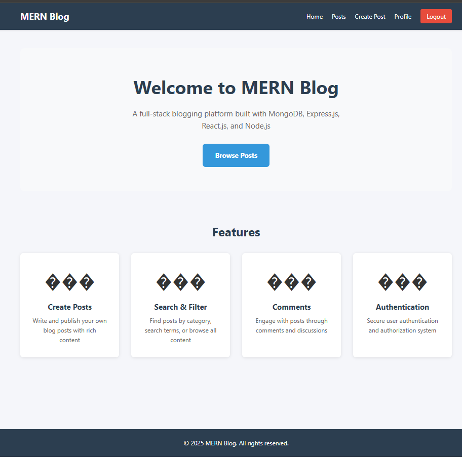
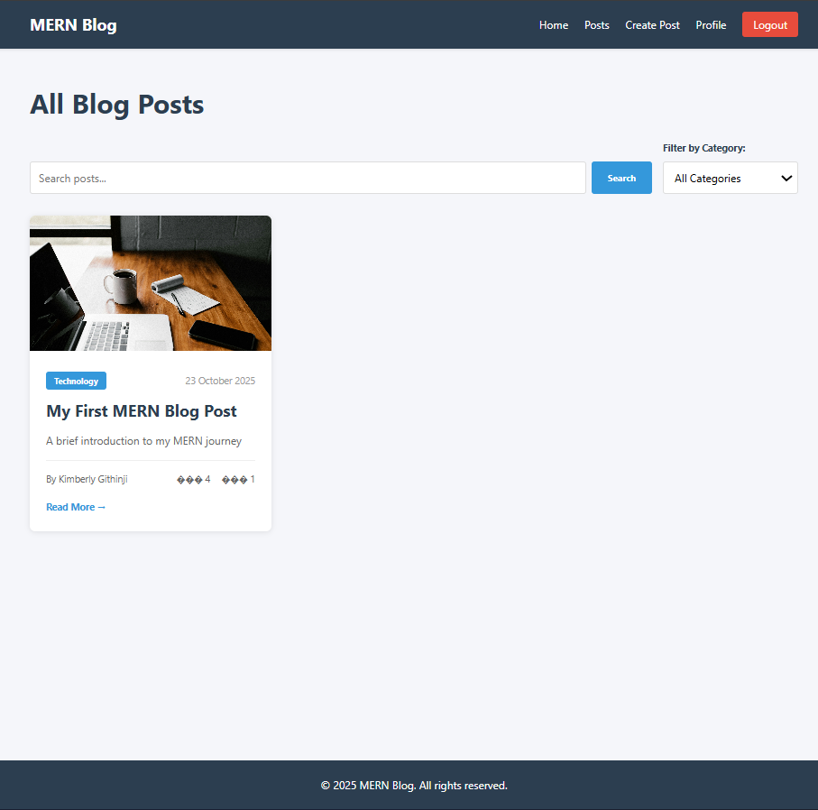
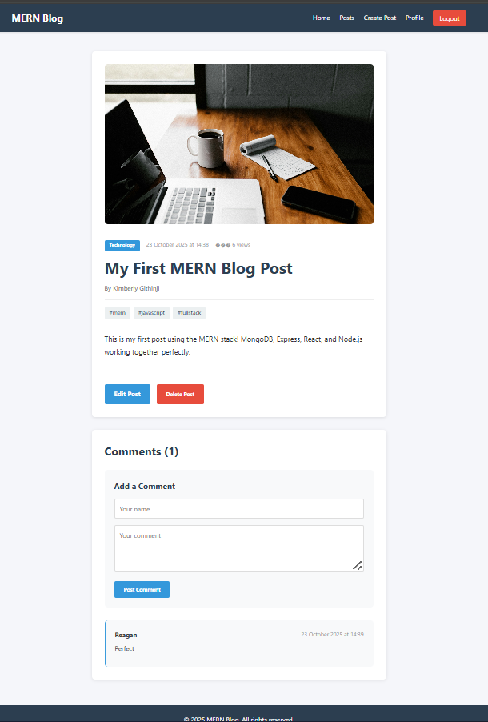
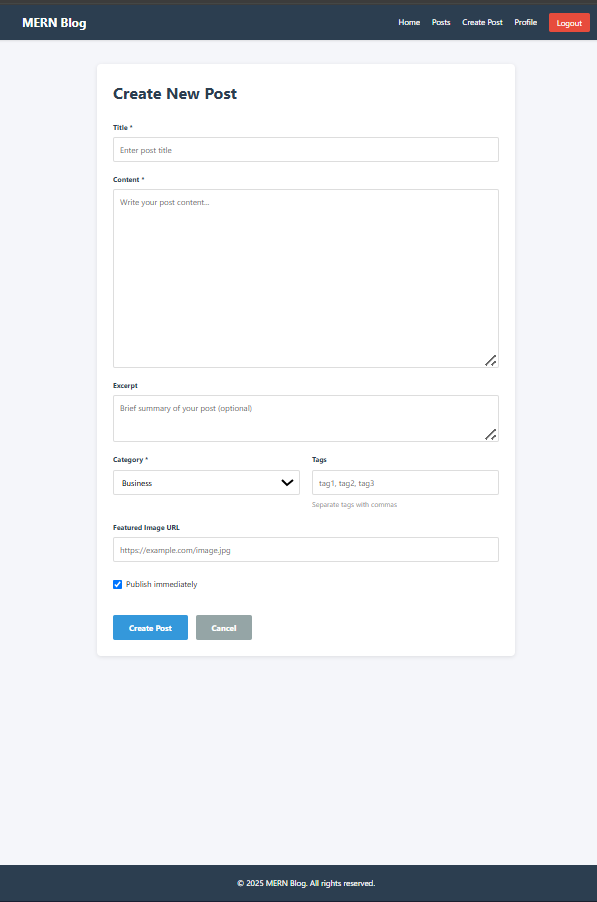
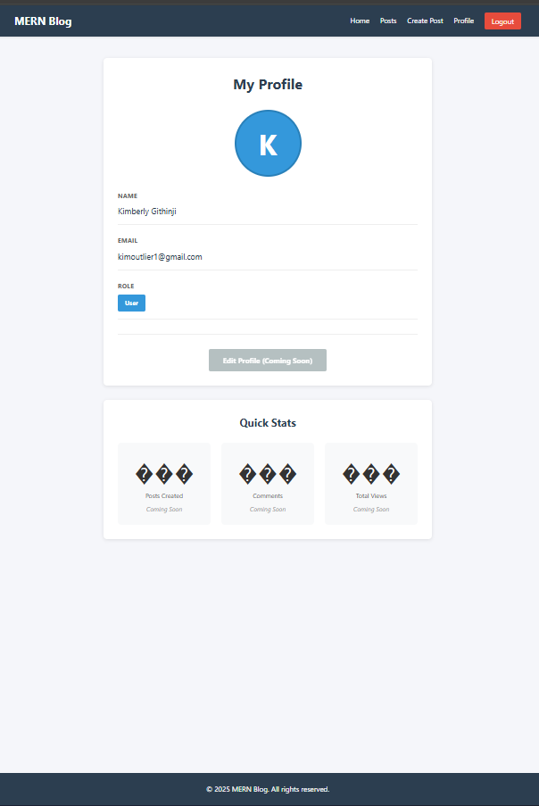

# MERN Stack Blog Application

A full-stack blog application built with MongoDB, Express.js, React.js, and Node.js featuring user authentication, CRUD operations, comments, search functionality, and pagination.

**Author:** Kimberly Githinji  
**Course:** Power Learn Project - Full Stack Web Development  
**Assignment:** Week 4 - MERN Stack Integration  
**Date:** October 23, 2025


---

## ��� Table of Contents

- [Project Overview](#project-overview)
- [Features](#features)
- [Tech Stack](#tech-stack)
- [Prerequisites](#prerequisites)
- [Installation & Setup](#installation--setup)
- [Running the Application](#running-the-application)
- [Application Screenshots](#application-screenshots)
- [API Documentation](#api-documentation)
- [Project Structure](#project-structure)
- [What I Learned](#what-i-learned)
- [Challenges & Solutions](#challenges--solutions)
- [Testing Guide](#testing-guide)

---

## ��� Project Overview

This is a comprehensive MERN stack blog application that demonstrates full-stack web development capabilities. The application allows users to create accounts, write and publish blog posts, comment on posts, search and filter content, and manage their profiles. It showcases the seamless integration of MongoDB, Express.js, React.js, and Node.js to create a production-ready web application.

### Project Highlights:
- **Full Authentication System:** Secure user registration and login with JWT tokens
- **Blog Management:** Complete CRUD operations for creating, reading, updating, and deleting posts
- **Interactive Features:** Comments system, post views counter, and user engagement
- **Search & Filter:** Dynamic search functionality with category-based filtering
- **Responsive Design:** Mobile-friendly interface that works on all devices
- **RESTful API:** Well-structured backend API following REST principles
- **State Management:** Efficient state handling using React Context API
- **Security:** Password hashing, input validation, and protected routes

---

## ✨ Features

### ��� User Authentication & Authorization
- User registration with validation
- Secure login with JWT token generation
- Password hashing using bcryptjs
- Protected routes requiring authentication
- User profile management
- Logout functionality with token cleanup

### ��� Blog Post Management
- Create new blog posts with rich content
- Edit existing posts (author/admin only)
- Delete posts (author/admin only)
- View all published posts
- View individual post details
- Featured image support
- Post categories and tags
- Draft/Publish functionality
- Automatic slug generation
- Post view counter

### ��� Comments System
- Add comments to posts (authenticated users)
- View all comments on a post
- Delete own comments
- Comment author display
- Timestamps for comments

### ��� Search & Filter Features
- Search posts by keywords
- Filter posts by category
- Combine search with filters
- Real-time search results
- Pagination for large result sets

### ��� Additional Features
- Pagination (10 posts per page)
- Post excerpt generation
- Category management
- User role system (user/admin)
- Loading states
- Error handling and validation
- Responsive navigation bar

---

## ���️ Tech Stack

### Backend Technologies

| Technology | Version | Purpose |
|------------|---------|---------|
| **Node.js** | v18+ | JavaScript runtime environment |
| **Express.js** | v4.18.2 | Web application framework |
| **MongoDB** | v6.0+ | NoSQL database |
| **Mongoose** | v8.0.3 | MongoDB object modeling |
| **JWT** | v9.0.2 | JSON Web Token authentication |
| **bcryptjs** | v2.4.3 | Password hashing |
| **express-validator** | v7.0.1 | Input validation |
| **cors** | v2.8.5 | Cross-origin resource sharing |
| **dotenv** | v16.3.1 | Environment variable management |
| **nodemon** | v3.0.2 | Development auto-restart |

### Frontend Technologies

| Technology | Version | Purpose |
|------------|---------|---------|
| **React.js** | v18.2.0 | UI library |
| **React Router** | v6.20.1 | Client-side routing |
| **Axios** | v1.6.2 | HTTP client |
| **Vite** | v5.0.8 | Build tool and dev server |
| **Context API** | Built-in | State management |

---

## ��� Prerequisites

Before running this application, ensure you have the following installed:

### Required Software

1. **Node.js (v18 or higher)**
   - Download from: https://nodejs.org/
   - Includes npm (Node Package Manager)

2. **MongoDB (v6.0 or higher)**
   - Download from: https://www.mongodb.com/try/download/community
   - Or use MongoDB Atlas (cloud database)

3. **Git**
   - Download from: https://git-scm.com/

### Verify Installation

Open your terminal and run these commands:
```bash
# Check Node.js version
node --version
# Expected output: v18.x.x or higher

# Check npm version
npm --version
# Expected output: 9.x.x or higher

# Check MongoDB version
mongosh --version
# Expected output: 2.x.x or higher
```

---

## ��� Installation & Setup

### Step 1: Install Server Dependencies

Navigate to the server directory and install all required packages:
```bash
cd server
npm install
```

**Packages installed:**
- express - Web framework
- mongoose - MongoDB ODM
- jsonwebtoken - JWT authentication
- bcryptjs - Password hashing
- cors - CORS middleware
- dotenv - Environment variables
- express-validator - Input validation
- nodemon - Development tool (dev dependency)

---

### Step 2: Install Client Dependencies

Navigate to the client directory and install all required packages:
```bash
cd ../client
npm install
```

**Packages installed:**
- react - UI library
- react-dom - React DOM renderer
- react-router-dom - Routing
- axios - HTTP client
- vite - Build tool
- @vitejs/plugin-react - React plugin for Vite

---

### Step 3: Configure Environment Variables

**Server Configuration:**

Create a `.env` file in the `server` directory with the following content:
```env
# Server Port
PORT=5000

# MongoDB Connection
MONGODB_URI=mongodb://localhost:27017/mern-blog

# JWT Secret (use a secure random string in production)
JWT_SECRET=a1b2c3d4e5f6g7h8i9j0k1l2m3n4o5p6q7r8s9t0u1v2w3x4y5z6

# Environment
NODE_ENV=development
```

**Client Configuration (Optional):**

Create a `.env` file in the `client` directory:
```env
# API Base URL
VITE_API_URL=http://localhost:5000/api
```

---

### Step 4: Initialize Database

**Start MongoDB:**
```bash
# For Windows (PowerShell as Administrator)
net start MongoDB

# Verify MongoDB is running
mongosh --eval "db.version()"
```

**Seed Initial Categories:**
```bash
cd server
node seed.js
```

**Expected Output:**
```
MongoDB Connected: localhost
✅ Categories seeded successfully
Categories created: Technology, Lifestyle, Travel, Food, Business, Health
```

This creates 6 initial blog categories that you can use when creating posts.

---

## ��� Running the Application

### Terminal 1: Start the Backend Server
```bash
cd server
npm run dev
```

**Expected Output:**
```
[nodemon] 3.1.10
[nodemon] to restart at any time, enter `rs`
[nodemon] watching path(s): *.*
[nodemon] watching extensions: js,mjs,cjs,json
[nodemon] starting `node server.js`
Server running in development mode on port 5000
MongoDB Connected: localhost
```

✅ **Server is now running on:** `http://localhost:5000`

**Keep this terminal window open!**

---

### Terminal 2: Start the Frontend Client

Open a **NEW** terminal window:
```bash
cd client
npm run dev
```

**Expected Output:**
```
VITE v5.4.21  ready in 541 ms

➜  Local:   http://localhost:3000/
➜  Network: use --host to expose
➜  press h + enter to show help
```

✅ **Client is now running on:** `http://localhost:3000` (or 3001 if 3000 is busy)

**Keep this terminal window open too!**

---

### Access the Application

Open your web browser and navigate to:
```
http://localhost:3000
```

(Or use the port shown in your terminal)

---

## ��� Application Screenshots

### 1. Development Environment Setup

#### MongoDB Running


*MongoDB successfully connected and running on localhost. This shows the database is ready to accept connections from the Express server.*

---

#### Server Running


*Express server running in development mode with nodemon on port 5000. The server has successfully connected to MongoDB and is ready to handle API requests.*

---

### 2. Application Interface

#### Home Page


*Landing page featuring a welcome message, overview of the platform features, call-to-action buttons for browsing posts and getting started, and a features showcase highlighting the key capabilities: Create Posts, Search & Filter, Comments, and Authentication.*

---

#### Posts List with Search and Filter


*Main posts page displaying all published blog posts in a grid layout. Features include a powerful search bar for finding specific content, category filter dropdown for organized browsing, pagination controls for navigating through multiple pages, and post cards showing title, excerpt, author, category, views, and comment counts.*

---

#### Single Post Detail


*Detailed view of an individual blog post showing the full content with rich formatting, featured image at the top, post metadata including author information, publication date, category, tags, and view count. Below the post content is the interactive comments section where authenticated users can read existing comments and add new ones.*

---

#### Create Post Form


*Comprehensive form interface for creating new blog posts. The form includes fields for title, content (large textarea), excerpt, category selection dropdown, tags input (comma-separated), featured image URL, and a publish/draft toggle checkbox. Form validation ensures all required fields are filled before submission.*

---

#### User Profile


*User profile page displaying account information including user name, email address, account role (user/admin), and bio section. The page features an avatar or initials placeholder at the top and a quick statistics dashboard showing posts created, comments made, and total post views (coming soon features).*

---

## ��� API Documentation

### Base URL
```
http://localhost:5000/api
```

### Authentication Header Format
For protected endpoints, include JWT token in the request header:
```
Authorization: Bearer <your_jwt_token>
```

---

## ��� Authentication API Endpoints

### 1. Register New User

**Endpoint:** `POST /api/auth/register`  
**Access:** Public  
**Description:** Create a new user account

**Request Body:**
```json
{
  "name": "John Doe",
  "email": "john@example.com",
  "password": "password123"
}
```

**Validation Rules:**
- Name: 2-50 characters (required)
- Email: Valid email format (required)
- Password: Minimum 6 characters (required)

**Success Response (201 Created):**
```json
{
  "_id": "507f1f77bcf86cd799439011",
  "name": "John Doe",
  "email": "john@example.com",
  "role": "user",
  "token": "eyJhbGciOiJIUzI1NiIsInR5cCI6IkpXVCJ9..."
}
```

**Error Response (400 Bad Request):**
```json
{
  "message": "User already exists"
}
```

---

### 2. Login User

**Endpoint:** `POST /api/auth/login`  
**Access:** Public  
**Description:** Authenticate user and receive JWT token

**Request Body:**
```json
{
  "email": "john@example.com",
  "password": "password123"
}
```

**Success Response (200 OK):**
```json
{
  "_id": "507f1f77bcf86cd799439011",
  "name": "John Doe",
  "email": "john@example.com",
  "role": "user",
  "token": "eyJhbGciOiJIUzI1NiIsInR5cCI6IkpXVCJ9..."
}
```

**Error Response (401 Unauthorized):**
```json
{
  "message": "Invalid email or password"
}
```

---

### 3. Get User Profile

**Endpoint:** `GET /api/auth/profile`  
**Access:** Private (requires authentication)  
**Description:** Get current user's profile information

**Request Headers:**
```
Authorization: Bearer <token>
```

**Success Response (200 OK):**
```json
{
  "_id": "507f1f77bcf86cd799439011",
  "name": "John Doe",
  "email": "john@example.com",
  "role": "user",
  "avatar": "",
  "bio": ""
}
```

---

### 4. Update User Profile

**Endpoint:** `PUT /api/auth/profile`  
**Access:** Private (requires authentication)  
**Description:** Update current user's profile

**Request Body:**
```json
{
  "name": "John Updated",
  "bio": "Full-stack developer passionate about MERN",
  "avatar": "https://example.com/avatar.jpg",
  "password": "newpassword123"
}
```

**Success Response (200 OK):**
```json
{
  "_id": "507f1f77bcf86cd799439011",
  "name": "John Updated",
  "email": "john@example.com",
  "role": "user",
  "avatar": "https://example.com/avatar.jpg",
  "bio": "Full-stack developer passionate about MERN",
  "token": "eyJhbGciOiJIUzI1NiIsInR5cCI6IkpXVCJ9..."
}
```

---

## ��� Blog Post API Endpoints

### 1. Get All Posts

**Endpoint:** `GET /api/posts`  
**Access:** Public  
**Description:** Retrieve all blog posts with pagination, search, and filtering

**Query Parameters:**

| Parameter | Type | Description | Default | Example |
|-----------|------|-------------|---------|---------|
| page | Number | Page number | 1 | `page=2` |
| limit | Number | Posts per page | 10 | `limit=20` |
| search | String | Search keyword | - | `search=react` |
| category | String | Category ID | - | `category=507f...` |
| published | Boolean | Filter by status | true | `published=false` |

**Example Request:**
```
GET /api/posts?page=1&limit=10&search=react&category=507f1f77bcf86cd799439011
```

**Success Response (200 OK):**
```json
{
  "posts": [
    {
      "_id": "507f1f77bcf86cd799439011",
      "title": "Introduction to React",
      "content": "React is a JavaScript library for building user interfaces...",
      "excerpt": "Learn the basics of React and component-based development",
      "author": {
        "_id": "507f1f77bcf86cd799439012",
        "name": "John Doe",
        "email": "john@example.com",
        "avatar": ""
      },
      "category": {
        "_id": "507f1f77bcf86cd799439013",
        "name": "Technology",
        "slug": "technology"
      },
      "tags": ["react", "javascript", "frontend"],
      "featuredImage": "https://example.com/react-image.jpg",
      "published": true,
      "views": 150,
      "comments": [],
      "createdAt": "2025-10-23T10:00:00.000Z",
      "updatedAt": "2025-10-23T10:00:00.000Z"
    }
  ],
  "currentPage": 1,
  "totalPages": 5,
  "totalPosts": 45
}
```

---

### 2. Get Single Post

**Endpoint:** `GET /api/posts/:id`  
**Access:** Public  
**Description:** Get detailed information about a specific post

**URL Parameters:**
- `id` - Post ID (MongoDB ObjectId)

**Success Response (200 OK):**
```json
{
  "_id": "507f1f77bcf86cd799439011",
  "title": "Introduction to React",
  "slug": "introduction-to-react",
  "content": "React is a JavaScript library for building user interfaces. It was developed by Facebook and is maintained by Facebook and a community of individual developers and companies...",
  "excerpt": "Learn the basics of React and component-based development",
  "author": {
    "_id": "507f1f77bcf86cd799439012",
    "name": "John Doe",
    "email": "john@example.com",
    "avatar": "",
    "bio": "Full-stack developer"
  },
  "category": {
    "_id": "507f1f77bcf86cd799439013",
    "name": "Technology",
    "slug": "technology",
    "description": "Posts about technology and innovation"
  },
  "tags": ["react", "javascript", "frontend"],
  "featuredImage": "https://example.com/react-image.jpg",
  "published": true,
  "views": 151,
  "comments": [
    {
      "_id": "507f1f77bcf86cd799439014",
      "author": "Jane Smith",
      "content": "Great article! Very helpful for beginners.",
      "user": {
        "_id": "507f1f77bcf86cd799439015",
        "name": "Jane Smith",
        "avatar": ""
      },
      "createdAt": "2025-10-23T11:00:00.000Z"
    }
  ],
  "createdAt": "2025-10-23T10:00:00.000Z",
  "updatedAt": "2025-10-23T10:00:00.000Z"
}
```

**Note:** View count automatically increments each time the post is accessed.

---

### 3. Create New Post

**Endpoint:** `POST /api/posts`  
**Access:** Private (requires authentication)  
**Description:** Create a new blog post

**Request Headers:**
```
Authorization: Bearer <token>
Content-Type: application/json
```

**Request Body:**
```json
{
  "title": "My New Blog Post",
  "content": "This is the full content of my blog post. It can be as long as needed and supports multiple paragraphs...",
  "excerpt": "A brief summary of the post for preview",
  "category": "507f1f77bcf86cd799439013",
  "tags": ["technology", "nodejs", "backend"],
  "featuredImage": "https://example.com/image.jpg",
  "published": true
}
```

**Validation Rules:**
- Title: 3-200 characters (required)
- Content: Minimum 10 characters (required)
- Category: Valid MongoDB ObjectId (required)
- Excerpt: Maximum 300 characters (optional, auto-generated if not provided)
- Tags: Array of strings (optional)
- FeaturedImage: Valid URL (optional)
- Published: Boolean (optional, default: false)

**Success Response (201 Created):**
```json
{
  "_id": "507f1f77bcf86cd799439016",
  "title": "My New Blog Post",
  "slug": "my-new-blog-post",
  "content": "This is the full content of my blog post...",
  "excerpt": "A brief summary of the post for preview",
  "author": {
    "_id": "507f1f77bcf86cd799439012",
    "name": "John Doe",
    "email": "john@example.com",
    "avatar": ""
  },
  "category": {
    "_id": "507f1f77bcf86cd799439013",
    "name": "Technology",
    "slug": "technology"
  },
  "tags": ["technology", "nodejs", "backend"],
  "featuredImage": "https://example.com/image.jpg",
  "published": true,
  "views": 0,
  "comments": [],
  "createdAt": "2025-10-23T12:00:00.000Z",
  "updatedAt": "2025-10-23T12:00:00.000Z"
}
```

---

### 4. Update Post

**Endpoint:** `PUT /api/posts/:id`  
**Access:** Private (author or admin only)  
**Description:** Update an existing post

**Authorization:**
- Post author can update their own posts
- Admin users can update any post

**Request Body:**
```json
{
  "title": "Updated Blog Post Title",
  "content": "Updated content with new information...",
  "excerpt": "Updated excerpt",
  "category": "507f1f77bcf86cd799439014",
  "tags": ["updated", "tags"],
  "published": true
}
```

**Success Response (200 OK):**
```json
{
  "_id": "507f1f77bcf86cd799439016",
  "title": "Updated Blog Post Title",
  "content": "Updated content with new information...",
  "published": true,
  "updatedAt": "2025-10-23T13:00:00.000Z"
}
```

---

### 5. Delete Post

**Endpoint:** `DELETE /api/posts/:id`  
**Access:** Private (author or admin only)  
**Description:** Delete a post permanently

**Authorization:**
- Post author can delete their own posts
- Admin users can delete any post

**Success Response (200 OK):**
```json
{
  "message": "Post deleted successfully"
}
```

**Error Response (403 Forbidden):**
```json
{
  "message": "Not authorized to delete this post"
}
```

---

### 6. Add Comment to Post

**Endpoint:** `POST /api/posts/:id/comments`  
**Access:** Private (requires authentication)  
**Description:** Add a comment to a specific post

**Request Body:**
```json
{
  "author": "John Doe",
  "content": "This is a great post! Very informative."
}
```

**Validation Rules:**
- Author: Required, non-empty string
- Content: 1-500 characters (required)

**Success Response (201 Created):**
```json
{
  "_id": "507f1f77bcf86cd799439016",
  "title": "My Blog Post",
  "comments": [
    {
      "_id": "507f1f77bcf86cd799439017",
      "author": "John Doe",
      "content": "This is a great post! Very informative.",
      "user": {
        "_id": "507f1f77bcf86cd799439012",
        "name": "John Doe",
        "avatar": ""
      },
      "createdAt": "2025-10-23T13:00:00.000Z"
    }
  ]
}
```

---

### 7. Delete Comment

**Endpoint:** `DELETE /api/posts/:id/comments/:commentId`  
**Access:** Private (comment author or admin only)  
**Description:** Delete a specific comment from a post

**URL Parameters:**
- `id` - Post ID
- `commentId` - Comment ID

**Authorization:**
- Comment author can delete their own comment
- Post author can delete any comment on their post
- Admin users can delete any comment

**Success Response (200 OK):**
```json
{
  "message": "Comment deleted successfully"
}
```

---

## ��� Category API Endpoints

### 1. Get All Categories

**Endpoint:** `GET /api/categories`  
**Access:** Public  
**Description:** Retrieve all available categories

**Success Response (200 OK):**
```json
[
  {
    "_id": "507f1f77bcf86cd799439013",
    "name": "Technology",
    "slug": "technology",
    "description": "Posts about technology and innovation",
    "createdAt": "2025-10-23T10:00:00.000Z",
    "updatedAt": "2025-10-23T10:00:00.000Z"
  },
  {
    "_id": "507f1f77bcf86cd799439014",
    "name": "Lifestyle",
    "slug": "lifestyle",
    "description": "Posts about lifestyle and daily living",
    "createdAt": "2025-10-23T10:00:00.000Z",
    "updatedAt": "2025-10-23T10:00:00.000Z"
  }
]
```

---

### 2. Get Single Category

**Endpoint:** `GET /api/categories/:id`  
**Access:** Public  
**Description:** Get details about a specific category including post count

**Success Response (200 OK):**
```json
{
  "_id": "507f1f77bcf86cd799439013",
  "name": "Technology",
  "slug": "technology",
  "description": "Posts about technology and innovation",
  "postsCount": 15,
  "createdAt": "2025-10-23T10:00:00.000Z",
  "updatedAt": "2025-10-23T10:00:00.000Z"
}
```

---

### 3. Create Category

**Endpoint:** `POST /api/categories`  
**Access:** Private (admin only)  
**Description:** Create a new category

**Request Body:**
```json
{
  "name": "Science",
  "description": "Posts about science and research"
}
```

**Validation Rules:**
- Name: 2-50 characters (required, unique)
- Description: Maximum 200 characters (optional)

**Success Response (201 Created):**
```json
{
  "_id": "507f1f77bcf86cd799439018",
  "name": "Science",
  "slug": "science",
  "description": "Posts about science and research",
  "createdAt": "2025-10-23T14:00:00.000Z",
  "updatedAt": "2025-10-23T14:00:00.000Z"
}
```

---

### 4. Update Category

**Endpoint:** `PUT /api/categories/:id`  
**Access:** Private (admin only)  
**Description:** Update an existing category

**Request Body:**
```json
{
  "name": "Updated Category Name",
  "description": "Updated description"
}
```

**Success Response (200 OK):**
```json
{
  "_id": "507f1f77bcf86cd799439018",
  "name": "Updated Category Name",
  "slug": "updated-category-name",
  "description": "Updated description",
  "createdAt": "2025-10-23T14:00:00.000Z",
  "updatedAt": "2025-10-23T15:00:00.000Z"
}
```

---

### 5. Delete Category

**Endpoint:** `DELETE /api/categories/:id`  
**Access:** Private (admin only)  
**Description:** Delete a category (only if no posts are using it)

**Success Response (200 OK):**
```json
{
  "message": "Category deleted successfully"
}
```

**Error Response (400 Bad Request):**
```json
{
  "message": "Cannot delete category. 5 post(s) are using this category."
}
```

---

## ���️ Project Structure
```
mern-stack-integration-Kimberly-ops177/
│
├── client/                              # Frontend React Application
│   ├── public/                          # Static assets
│   ├── src/
│   │   ├── components/                  # Reusable React components
│   │   │   ├── ErrorMessage.jsx         # Error display component
│   │   │   ├── Loading.jsx              # Loading spinner component
│   │   │   ├── Navbar.jsx               # Navigation bar with auth state
│   │   │   ├── PostCard.jsx             # Post preview card component
│   │   │   └── ProtectedRoute.jsx       # Route protection wrapper
│   │   │
│   │   ├── context/                     # React Context for state management
│   │   │   └── AuthContext.jsx          # Authentication state and methods
│   │   │
│   │   ├── hooks/                       # Custom React hooks
│   │   │   ├── useAPI.js                # Custom hook for API calls
│   │   │   └── useAuth.js               # Custom hook for auth operations
│   │   │
│   │   ├── pages/                       # Page components (routes)
│   │   │   ├── Home.jsx                 # Landing page
│   │   │   ├── Login.jsx                # Login page
│   │   │   ├── Register.jsx             # User registration page
│   │   │   ├── PostsList.jsx            # All posts list with pagination
│   │   │   ├── PostDetail.jsx           # Single post view with comments
│   │   │   ├── CreatePost.jsx           # Create new post form
│   │   │   ├── EditPost.jsx             # Edit existing post form
│   │   │   └── Profile.jsx              # User profile page
│   │   │
│   │   ├── services/                    # API service layer
│   │   │   └── api.js                   # Axios configuration and API calls
│   │   │
│   │   ├── App.jsx                      # Main application component with routing
│   │   ├── index.css                    # Global styles
│   │   └── main.jsx                     # React entry point
│   │
│   ├── .env                             # Environment variables (not in git)
│   ├── .env.example                     # Environment template
│   ├── index.html                       # HTML template
│   ├── package.json                     # Client dependencies
│   └── vite.config.js                   # Vite configuration with proxy
│
├── server/                              # Backend Express Application
│   ├── config/
│   │   └── db.js                        # MongoDB connection configuration
│   │
│   ├── controllers/                     # Route controllers (business logic)
│   │   ├── authController.js            # Authentication logic
│   │   ├── categoryController.js        # Category CRUD operations
│   │   └── postController.js            # Post CRUD and comment operations
│   │
│   ├── middleware/                      # Custom Express middleware
│   │   ├── auth.js                      # JWT authentication middleware
│   │   ├── errorHandler.js              # Global error handling
│   │   └── validation.js                # Request validation middleware
│   │
│   ├── models/                          # Mongoose schemas and models
│   │   ├── Category.js                  # Category model
│   │   ├── Post.js                      # Post model (includes comments schema)
│   │   └── User.js                      # User model with password hashing
│   │
│   ├── routes/                          # API route definitions
│   │   ├── authRoutes.js                # Authentication routes
│   │   ├── categoryRoutes.js            # Category routes
│   │   └── postRoutes.js                # Post and comment routes
│   │
│   ├── .env                             # Environment variables (not in git)
│   ├── .env.example                     # Environment template
│   ├── package.json                     # Server dependencies
│   ├── seed.js                          # Database seeder for categories
│   └── server.js                        # Express server setup and config
│
├── screenshots/                         # Application screenshots
│   ├── create-post.png                  # Create post form screenshot
│   ├── home.png                         # Home page screenshot
│   ├── Mongo Run.png                    # MongoDB running screenshot
│   ├── post-detail.png                  # Post detail page screenshot
│   ├── posts-list.png                   # Posts list page screenshot
│   ├── profile.png                      # User profile screenshot
│   └── Server running.png               # Server running screenshot
│
├── .gitignore                           # Git ignore rules
└── README.md                            # This file - Project documentation
```

### Key Architectural Decisions:

**Backend Architecture:**
- **MVC Pattern:** Controllers handle business logic, models define data schemas
- **Middleware Chain:** Authentication → Validation → Controller → Response
- **Mongoose Schemas:** Embedded comments in posts for better performance
- **JWT Strategy:** Stateless authentication with token expiration

**Frontend Architecture:**
- **Component-Based:** Reusable components for maintainability
- **Context API:** Global auth state accessible to all components
- **Custom Hooks:** Abstracted API logic for cleaner components
- **Protected Routes:** Route-level authentication checks

**Database Design:**
- **Users Collection:** Stores user credentials and profile info
- **Posts Collection:** Contains posts with embedded comments
- **Categories Collection:** Separate collection for categories
- **Relationships:** Posts reference users (author) and categories

---

## ��� What I Learned

### Backend Development Skills

**1. Express.js and RESTful API Design**
- Learned to structure a RESTful API with proper HTTP methods (GET, POST, PUT, DELETE)
- Implemented middleware chain for request processing
- Created modular route handlers for better code organization
- Used express-validator for input validation and sanitization

**2. MongoDB and Mongoose**
- Designed database schemas with proper data types and validation
- Implemented relationships between collections (referenced and embedded)
- Created indexes for better query performance
- Used Mongoose middleware (pre-save hooks) for password hashing
- Performed CRUD operations efficiently

**3. Authentication & Security**
- Implemented JWT-based authentication system
- Learned password hashing with bcryptjs
- Created protected routes with authentication middleware
- Managed token generation and verification
- Implemented role-based access control

**4. Error Handling**
- Created centralized error handling middleware
- Implemented try-catch blocks for async operations
- Provided meaningful error messages to clients
- Handled various error types (validation, authentication, database)

---

### Frontend Development Skills

**1. React.js Fundamentals**
- Built functional components with hooks
- Managed component state with useState
- Handled side effects with useEffect
- Created custom hooks for reusable logic
- Implemented conditional rendering

**2. React Router**
- Set up client-side routing
- Created protected routes
- Implemented navigation with Link components
- Used useNavigate for programmatic navigation
- Accessed route parameters with useParams

**3. State Management**
- Implemented Context API for global state
- Created AuthContext for authentication state
- Passed state and functions through context
- Consumed context with useContext hook

**4. API Integration**
- Configured Axios for HTTP requests
- Implemented request interceptors for auth tokens
- Handled loading and error states
- Made async API calls with proper error handling
- Displayed API data in components

---

### Full-Stack Integration Skills

**1. CORS Configuration**
- Configured CORS middleware in Express
- Understood cross-origin request concepts
- Set up proper headers for client-server communication

**2. Environment Variables**
- Used dotenv for sensitive configuration
- Separated development and production configs
- Secured API keys and database credentials

**3. Development Workflow**
- Set up separate dev servers for client and server
- Used nodemon for server auto-restart
- Configured Vite proxy for API requests
- Implemented hot module replacement

**4. Data Flow**
- Understood client-server request-response cycle
- Implemented proper data serialization
- Managed authentication token lifecycle
- Synchronized frontend and backend state

---

## ��� Challenges & Solutions

### Challenge 1: JWT Token Management
**Problem:** Initially struggled with passing JWT tokens in API requests and maintaining authentication state.

**What I Tried:**
- Manually adding token to each request
- Storing token in component state

**Solution:**
```javascript
// Created Axios interceptor to automatically add token
api.interceptors.request.use((config) => {
  const token = localStorage.getItem('token');
  if (token) {
    config.headers.Authorization = `Bearer ${token}`;
  }
  return config;
});
```

**Lesson Learned:** Interceptors are powerful for handling cross-cutting concerns like authentication globally.

---

### Challenge 2: MongoDB Relationships
**Problem:** Confusion about whether to embed comments in posts or create a separate comments collection.

**What I Considered:**
- Separate comments collection (normalized)
- Embedded comments in posts (denormalized)

**Solution:**  
Chose embedded comments because:
- Comments are always accessed with the post
- Simplifies queries (one database call instead of two)
- Better performance for this use case

**Lesson Learned:** Database design depends on access patterns and query requirements.

---

### Challenge 3: Protected Routes
**Problem:** Users could access protected pages by typing the URL directly, even when not logged in.

**Solution:**
```javascript
// Created ProtectedRoute wrapper component
const ProtectedRoute = ({ children }) => {
  const { user, loading } = useAuth();
  
  if (loading) return <Loading />;
  if (!user) return <Navigate to="/login" replace />;
  
  return children;
};
```

**Lesson Learned:** Client-side route protection enhances UX, but server-side validation is crucial for security.

---

### Challenge 4: Form Validation
**Problem:** Needed validation on both client and server sides without code duplication.

**Solution:**
- Client-side: HTML5 validation + custom validation for UX
- Server-side: express-validator for security
- Different purposes, both necessary

**Lesson Learned:** Never trust client-side validation alone; always validate on the server.

---

### Challenge 5: Async State Updates
**Problem:** State wasn't updating immediately after API calls, causing UI inconsistencies.

**Solution:**
```javascript
// Wait for API response before updating state
const handleDelete = async () => {
  await postsAPI.deletePost(id);
  // Navigate only after successful deletion
  navigate('/posts');
};
```

**Lesson Learned:** Understanding the async nature of API calls and state updates is critical.

---

### Challenge 6: CORS Errors
**Problem:** Initially got CORS errors when trying to make API calls from React to Express.

**Solution:**
```javascript
// Server: Installed and configured CORS middleware
app.use(cors());

// Client: Configured Vite proxy
proxy: {
  '/api': {
    target: 'http://localhost:5000',
    changeOrigin: true
  }
}
```

**Lesson Learned:** CORS is a security feature, not a bug. Understanding it is essential for full-stack development.

---

### Challenge 7: Missing main.jsx File
**Problem:** Vite server failed to start with "Failed to load url /src/main.jsx".

**Solution:**
- Created main.jsx as the entry point
- Properly imported React and ReactDOM
- Linked to index.html

**Lesson Learned:** Build tools have specific requirements for project structure; follow conventions.

---

## ��� Testing Guide

### Manual Testing Checklist

#### Authentication Tests
- [ ] **Register new user**
  - Navigate to /register
  - Fill in valid details
  - Submit form
  - Verify redirect to posts page
  - Check token in localStorage

- [ ] **Register with existing email**
  - Try registering with same email
  - Verify error message displayed

- [ ] **Login**
  - Navigate to /login
  - Enter valid credentials
  - Verify successful login and redirect

- [ ] **Login with wrong password**
  - Enter incorrect password
  - Verify error message

- [ ] **Protected route access**
  - Logout
  - Try accessing /create-post directly
  - Verify redirect to /login

- [ ] **Logout**
  - Click logout button
  - Verify redirect to home
  - Check token removed from localStorage

---

#### Post Management Tests
- [ ] **View all posts**
  - Navigate to /posts
  - Verify posts displayed in grid
  - Check pagination controls

- [ ] **Create new post**
  - Click "Create Post"
  - Fill in all fields
  - Submit form
  - Verify redirect to new post

- [ ] **View single post**
  - Click on any post
  - Verify all details displayed
  - Check view count incremented

- [ ] **Edit own post**
  - Open your post
  - Click "Edit Post"
  - Modify content
  - Save changes
  - Verify updates displayed

- [ ] **Try editing others' post**
  - Create second account
  - Try editing first user's post
  - Verify "Edit" button not visible

- [ ] **Delete own post**
  - Open your post
  - Click "Delete Post"
  - Confirm deletion
  - Verify redirect to posts list

---

#### Search & Filter Tests
- [ ] **Search posts**
  - Enter keyword in search box
  - Click Search
  - Verify matching results

- [ ] **Filter by category**
  - Select category from dropdown
  - Verify filtered results

- [ ] **Combine search and filter**
  - Enter search term
  - Select category
  - Verify combined results

- [ ] **Pagination**
  - Create 15+ posts
  - Verify pagination controls appear
  - Click "Next"
  - Verify different posts shown

---

#### Comments Tests
- [ ] **Add comment**
  - Open any post
  - Fill comment form
  - Submit
  - Verify comment appears

- [ ] **View comments**
  - Verify all comments displayed
  - Check timestamps

- [ ] **Delete own comment**
  - Click delete on your comment
  - Confirm deletion
  - Verify comment removed

- [ ] **Try deleting others' comment**
  - Create second account
  - Try deleting first user's comment
  - Verify delete button not visible (unless admin)

---

#### Profile Tests
- [ ] **View profile**
  - Click "Profile"
  - Verify all info displayed correctly
  - Check role badge

---

### API Testing with cURL
```bash
# Register user
curl -X POST http://localhost:5000/api/auth/register \
  -H "Content-Type: application/json" \
  -d '{"name":"Test User","email":"test@test.com","password":"test123"}'

# Login
curl -X POST http://localhost:5000/api/auth/login \
  -H "Content-Type: application/json" \
  -d '{"email":"test@test.com","password":"test123"}'

# Get all posts
curl http://localhost:5000/api/posts

# Create post (replace TOKEN)
curl -X POST http://localhost:5000/api/posts \
  -H "Content-Type: application/json" \
  -H "Authorization: Bearer TOKEN" \
  -d '{"title":"Test Post","content":"Test content","category":"CATEGORY_ID"}'
```

---

## ��� Assignment Requirements Checklist

### Core Requirements
- [x] **MongoDB Integration**
  - [x] Database connected successfully
  - [x] Schemas created for Users, Posts, Categories
  - [x] CRUD operations implemented
  - [x] Relationships between collections

- [x] **Express.js Backend**
  - [x] RESTful API endpoints created
  - [x] Middleware implemented (auth, validation, error handling)
  - [x] Proper route organization
  - [x] Environment variables configured

- [x] **React Frontend**
  - [x] Component-based architecture
  - [x] React Router for navigation
  - [x] State management with Context API
  - [x] API integration with Axios
  - [x] Responsive design

- [x] **Node.js Server**
  - [x] Express server configured
  - [x] CORS enabled
  - [x] Error handling middleware
  - [x] Development and production modes

- [x] **Authentication**
  - [x] User registration
  - [x] User login
  - [x] JWT token generation
  - [x] Password hashing
  - [x] Protected routes

### Advanced Features
- [x] **Search & Filter**
  - [x] Search posts by keywords
  - [x] Filter posts by category
  - [x] Pagination

- [x] **Comments System**
  - [x] Add comments
  - [x] View comments
  - [x] Delete comments

- [x] **Additional Features**
  - [x] Post views counter
  - [x] Tags system
  - [x] Featured images
  - [x] Draft/Publish functionality
  - [x] User profiles

### Documentation
- [x] **README.md**
  - [x] Project overview
  - [x] Setup instructions
  - [x] API documentation
  - [x] Screenshots
  - [x] What I learned section

- [x] **Code Quality**
  - [x] Clean, readable code
  - [x] Proper file organization
  - [x] Meaningful variable names
  - [x] Error handling

---

## ��� Future Enhancements

If I continue working on this project, I would add:

1. **User Avatar Uploads**
   - Allow users to upload profile pictures
   - Integrate with Cloudinary or AWS S3

2. **Rich Text Editor**
   - Implement WYSIWYG editor for post content
   - Support markdown formatting

3. **Post Reactions**
   - Like/Unlike posts
   - Favorite/Bookmark functionality

4. **Email Notifications**
   - Send email on new comments
   - Password reset via email

5. **Social Sharing**
   - Share posts on social media
   - Generate Open Graph meta tags

6. **Admin Dashboard**
   - Manage all users
   - Moderate comments
   - View analytics

7. **Responsive Improvements**
   - Better mobile navigation
   - Touch-friendly interactions

8. **Performance Optimization**
   - Implement caching
   - Image lazy loading
   - Code splitting

---

## ��� Author

**Kimberly Opondo**  
Full Stack Web Development Student  
Power Learn Project - Cohort 2024/2025

**GitHub:** [@Kimberly-ops177](https://github.com/Kimberly-ops177)  
**Repository:** [mern-stack-integration-Kimberly-ops177](https://github.com/Kimberly-ops177/mern-stack-integration-Kimberly-ops177)

---

## ��� Acknowledgments

I would like to thank:

- **Power Learn Project** - For providing comprehensive curriculum and guidance on MERN stack development
- **Instructors and Mentors** - For their support throughout the learning process
- **MongoDB Documentation Team** - For excellent documentation that helped me understand database concepts
- **React Community** - For the wealth of resources and tutorials available
- **Express.js Community** - For the robust framework and documentation
- **Fellow Students** - For collaboration and peer learning

---

## ��� Project Statistics

- **Total Lines of Code:** ~3,500+
- **Development Time:** 1 Week
- **Technologies Used:** 15+
- **Components Created:** 13
- **API Endpoints:** 20+
- **Features Implemented:** 18

---

## ��� License

This project was created as an educational assignment for Power Learn Project Full Stack Web Development course. It is intended for learning purposes and portfolio demonstration.

---

## ��� Contact & Support

For questions or feedback about this project:

- **GitHub Issues:** [Create an issue](https://github.com/Kimberly-ops177/mern-stack-integration-Kimberly-ops177/issues)
- **Email:** kimoutlier1@gmail.com

---

**��� Power Learn Project - Full Stack Web Development**  
**��� Week 4 Assignment: MERN Stack Integration**  
**✅ Status: Completed**  
**��� Submission Date: October 23, 2025**

---

**Built with dedication, passion, and lots of coffee! ☕**

*"The only way to learn a new programming language is by writing programs in it." - Dennis Ritchie*

---

**#MERN #FullStack #WebDevelopment #PowerLearnProject #JavaScript #React #Node #Express #MongoDB**
